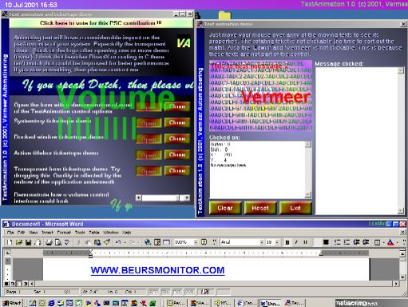



## Ticker Mania

### Description

New in this demo: Active titlebar skin (all running applications) and a new version of my award winning Textanimation control. Extra in this version is: transparent background, Picture background, Transparent background of parent form!, a lot of gradient options, MousIn and Mouse out events, ..?  

Also in this demo: system tray skin with tickertape, docked window with tickertape, text animation demo, transparent animation (including form), vertical titlebar, gradient form, button control with a lot of properties, Win2k form transparency, animating logo, ...?  

This publication is using code of about a dozen developers, so thanks everyone.
 
### More Info
 

             |
---                |---
**Submitted On**   |2001-07-11 08:59:16
**By**             |[Edwin Vermeer\.](https://github.com/Planet-Source-Code/PSCIndex/blob/master/ByAuthor/edwin-vermeer.md)
**Level**          |Advanced
**User Rating**    |5.0 (426 globes from 86 users)
**Compatibility**  |VB 6\.0
**Category**       |[Custom Controls/ Forms/  Menus](https://github.com/Planet-Source-Code/PSCIndex/blob/master/ByCategory/custom-controls-forms-menus__1-4.md)
**World**          |[Visual Basic](https://github.com/Planet-Source-Code/PSCIndex/blob/master/ByWorld/visual-basic.md)
**Archive File**   |[Ticker Man225397112001\.zip](https://github.com/Planet-Source-Code/edwin-vermeer-ticker-mania__1-24869/archive/master.zip)

